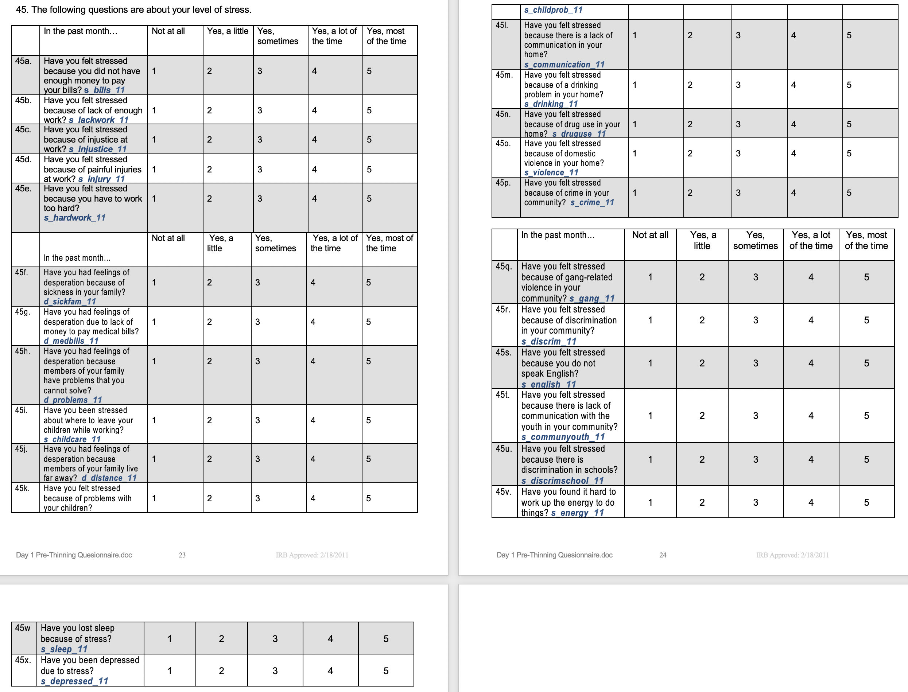
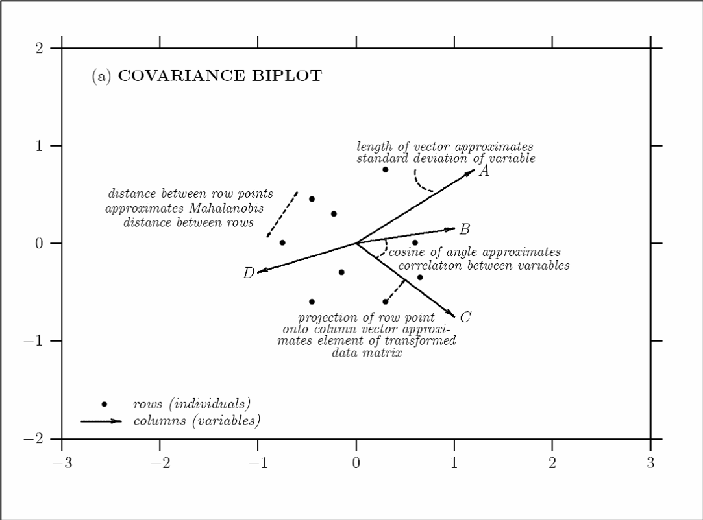

```{r libraries, eval = TRUE, echo = FALSE, results = FALSE, warning = FALSE, message = FALSE}
package_loader <- function(x, ...) {
    if (x %in% rownames(installed.packages()) == FALSE) install.packages(x)
    library(x, ...)
}

packages <- c("knitr", "bookdown", "kableExtra", "reshape2", "Hmisc", "dplyr", "DT", "scatterplot3d", "rgl", "ggplot2", "ellipse", "lattice")

invisible(sapply(X = packages, FUN = package_loader, character.only = TRUE))
```

# Introduction

## Outline

1. What is PCA?
    + General Description
    + Geometric Interpretation

2. Application
    + Description
    + Output
    + Graphical Interpretation
    + Inference

# What is PCA?

## General Description Part 1

* PCA is an exploratory data dimension reduction technique.
    + Exploratory – No a priori assumptions about the structure of the data.  Because of this, we say PCA is an unsupervised machine learning method.
    + Dimension Reduction – Some data sets have a large number of variables or features.  PCA provides a way of reducing a large feature space into a few summary variables.

## General Description Part 2

* PCA creates axes that explain decreasing amounts of variation in the data.  
    + The first PC axis (PC1) is the direction of most variation.  The second PC axis (PC2) explains the second most variation and is orthogonal to PC1. 
    + Orthogonality means the PC axes are uncorrelated.
    + There are as many PC axes as there are variables in the data.
    + Together, the PC axes explain 100% of the observed variation in the data.

# 2-Dimensional PCA Example

```{r 2dDataSetup, eval = TRUE, echo = FALSE, results = TRUE, warning = FALSE, message = FALSE}
set.seed(4)

x1 <- runif(100, .2, .8)  # Random values for x
x2 <- 0 + 1/2*x1 # Linear association between x1 and x2, (slope = 1/2, intercept = 0)
x1 <- scale(x1)
x2 <- scale(x2)

error_x1 <- runif(100, -.1, 3)
x1 <- x1 + error_x1
x1 <- scale(x1)

error_x2 <- runif(100, -.1, 3)
x2 <- x2 + error_x2
x2 <- scale(x2)

X <- as.data.frame(cbind(x1, x2))

pc_ex1 <- prcomp(~x1 + x2, X) 
# round(pc_ex1$sdev/sum(pc_ex1$sdev), 2)*100

pc_ex1$rotation <- pc_ex1$rotation*(-1) # Sign of the loadings are arbitrary.
# http://www.zoology.ubc.ca/~schluter/bio501/Rtips.multivariate.html
U = pc_ex1$rotation  # Loadings Matrix

Z = predict(pc_ex1) #S cores Matrix
Z = predict(pc_ex1)*(-1) # Because I can :).  The sign of the scores are arbitrary, because the sign of the loadings are arbitrary. (represent the same PC direction)
#http://www.zoology.ubc.ca/~schluter/bio501/Rtips.multivariate.html

Z1 = cbind(Z[,1], rep(0,100))
X1 = Z1 %*% t(U) # Project Z1 back into X-space

Z2 = cbind(rep(0,100), Z[,2])
X2 = Z2 %*% t(U) # Project Z2 back into X-space

#Z[,1]%*%Z[,2] # Dot product is zero, imply Z[,1] is orthogonal to Z[,2]
```

## Simulated Data

What is the direction of most variability for x1 and x2?

```{r 2dData, eval = TRUE, echo = FALSE, results = TRUE, warning = FALSE, message = FALSE}
# 2d Data
plot(x1, x2, xlim = c(-2.5, 2.5), ylim = c(-2.5, 2.5), col = "#00336677", pch = 16)
```

## PC1

What is the direction that explains the second most amount of variation?

```{r 2dDataPC1, eval = TRUE, echo = FALSE, results = TRUE, warning = FALSE, message = FALSE}
plot(x1, x2, xlim = c(-2.5, 2.5), ylim = c(-2.5, 2.5), col = "#00336677", pch = 16)
segments(x0 = min(X1[,1]), y0 = min(X1[,2]), x1 = max(X1[,1]), y1 = max(X1[,2]), col = "#FF0000", lwd = 2)
text(x = max(X1[,1])*1.05, y = max(X1[,2])*1.05, "PC1 (64%)")
```

## PC2

```{r 2dDataPC1PC2, eval = TRUE, echo = FALSE, results = TRUE, warning = FALSE, message = FALSE}
# 2d data pc1 pc2
plot(x1, x2, xlim = c(-2.5, 2.5), ylim = c(-2.5, 2.5), col  =  "#00336677", pch  =  16)
segments(x0 = min(X1[,1]), y0 = min(X1[,2]), x1 = max(X1[,1]), y1 = max(X1[,2]), col = "#FF0000", lwd = 2)
segments(x0 = min(X2[,1])*1.5, y0 = max(X2[,2])*1.5, x1 = max(X2[,1])*1.5, y1 = min(X2[,2])*1.5, col = "#FF0000", lwd = 2)

text(x = max(X1[,1])*1.05, y = max(X1[,2])*1.05, "PC1 (64%)")
text(x = min(X2[,1])*1.61, y = max(X2[,2])*1.61, "PC2 (36%)")
```

## Projection of Data onto PC1

```{r 2dDataPC1scorePC2, eval = TRUE, echo = FALSE, results = TRUE, warning = FALSE, message = FALSE}
plot(x1, x2, xlim = c(-2.5, 2.5), ylim = c(-2.5, 2.5), col  =  "#00336677", pch  =  16)
segments(x0 = min(X1[,1]), y0 = min(X1[,2]), x1 = max(X1[,1]), y1 = max(X1[,2]), col = "#FF0000", lwd = 2)
points(X1[,1], X1[,2], col = "#00000077", pch = 16, cex = 1) #PC1

segments(x0 = min(X2[,1])*1.5, y0 = max(X2[,2])*1.5, x1 = max(X2[,1])*1.5, y1 = min(X2[,2])*1.5, col = "#FF0000", lwd = 2)

segments(x0 = x1[13], y0 = x2[13], x1 = X1[13,1], y1 = X1[13,2], col = "#339900", lwd = 2, lty = 1)
points(x1[13], x2[13], col = "purple", pch = 16, cex = 2)
points(X1[13,1], X1[13,2], col = "#FF66FF", pch  =  16, cex = 1.5)

text(x = max(X1[,1])*1.05, y = max(X1[,2])*1.05, "PC1 (64%)")
text(x = min(X2[,1])*1.61, y = max(X2[,2])*1.61, "PC2 (36%)")
```

## Projection of Data onto PC2

```{r 2dDataPC1scorePC2scores, eval = TRUE, echo = FALSE, results = TRUE, warning = FALSE, message = FALSE}
# 2d data pc1 scores pc2 scores
plot(x1, x2, xlim = c(-2.5, 2.5), ylim = c(-2.5, 2.5), col  =  "#00336677", pch  =  16)
segments(x0 = min(X1[,1]), y0 = min(X1[,2]), x1 = max(X1[,1]), y1 = max(X1[,2]), col = "#FF0000", lwd = 2)
segments(x0 = min(X2[,1])*1.5, y0 = max(X2[,2])*1.5, x1 = max(X2[,1])*1.5, y1 = min(X2[,2])*1.5, col = "#FF0000", lwd = 2)
points(X1[,1], X1[,2], col = "#00000077", pch = 16, cex = 1) #PC1
points(X2[,1], X2[,2], col = "#00000077", pch = 16, cex = 1)

segments(x0 = x1[13], y0 = x2[13], x1 = X1[13,1], y1 = X1[13,2], col = "#339900", lwd = 2, lty = 1)
segments(x0 = x1[13], y0 = x2[13], x1 = X2[13,1], y1 = X2[13,2], col = "#339900", lwd = 2, lty = 1)
points(x1[13], x2[13], col = "purple", pch = 16, cex = 2)
points(X1[13,1], X1[13,2], col = "#FF66FF", pch = 16, cex = 1.5)
points(X2[13,1], X2[13,2], col = "#FF66FF", pch = 16, cex = 1.5)

text(x = max(X1[,1])*1.05, y = max(X1[,2])*1.05, "PC1 (64%)")
text(x = min(X2[,1])*1.61, y = max(X2[,2])*1.61, "PC2 (36%)")
```

# 3-Dimensional PCA Example

```{r 3dDataSetup, eval = TRUE, echo = FALSE, results = TRUE, warning = FALSE, message = FALSE}
set.seed(2)
x1 <- runif(100, .2, .8)  #Random values for x
x2 <- runif(100, .2, .8)  #Random values for x
x3 <- 0 + 1/2*x1 + 0.3*x2 #Define a plane

x1 <- scale(x1)
x2 <- scale(x2)
x3 <- scale(x3)

error1 <- runif(100, -25, 25)
x1_err <- x1 + error1
error2 <- runif(100, -1, 1)
x2_err <- x2 + error2

x1_err <- scale(x1_err)
x2_err <- scale(x2_err)

#spheres3d(x = x1, y = x2, z = x3, col="#FF000077", radius=.05)
#bbox3d(col="white")
#rgl.bg(sphere=TRUE, color=c("black", "green"), lit=FALSE, back="line")
#rgl.close()

#spheres3d(x = x1, y = x2, z = x3, col="#FF000077", radius=.05)
#spheres3d(x = x1_err, y = x2_err, z = x3, col="#003366", radius=.05)
#bbox3d(col="white")
#axis3d(col="white", edges="bbox")
#rgl.bg(sphere=TRUE, color=c("black", "green"), lit=FALSE, back="lines")
#rgl.close()

pc_ex2 <- prcomp(~x1_err + x2_err + x3, X)
# round(pc_ex2$sdev/sum(pc_ex2$sdev), 2)*100
pc_ex2$rotation <- pc_ex2$rotation*(-1)
U = pc_ex2$rotation #Loadings Matrix

Z = predict(pc_ex2)*(-1) #Scores Matrix

Z1 = cbind(Z[,1], rep(0,100), rep(0,100))
X1 = Z1 %*% t(U) #Project Z1 back into X-space

Z2 = cbind(rep(0,100), Z[,2], rep(0,100))
X2 = Z2 %*% t(U) #Project Z2 back into X-space

Z3 = cbind(rep(0,100), rep(0,100), Z[,3])
X3 = Z3 %*% t(U) #Project Z2 back into X-space
```

## Simulated Data

* This example is the same as the 2-Dimensional example, but we will add in a third data dimension.  Call the new variable x3.

* Control the 3D plot with your mouse.  Scroll to zoom in and out.

```{r 3dData, eval = TRUE, echo = FALSE, results = TRUE, warning = FALSE, message = FALSE}
spheres3d(x = x1_err, y = x2_err, z = x3, col = "#0033FF", radius = .05, point_antialias = TRUE, fog = FALSE)
rgl.bg(sphere = FALSE, fogtype = "linear", color = "white")
rgl.lines(c(-3,3), c(0, 0), c(0, 0), col = "black")
rgl.lines(c(0, 0), c(-3,3), c(0, 0), col = "black")
rgl.lines(c(0, 0), c(0, 0), c(-3,3), col = "black")
rgl.texts(1.1 * -3, 0, 0, "x1", col = "black", adj = 0.5, cex = 1.5)
rgl.texts(0, 1.1 * -3, 0, "x2", col = "black", adj = 0.5, cex = 1.5)
rgl.texts(0, 0, 1.1 * -3, "x3", col = "black", adj = 0.5, cex = 1.5)

rglwidget(width = 600, height = 600)
```

##  Projection of Data onto PC1

* Control the 3D plot with your mouse.  Scroll to zoom in and out.

```{r 3dDataPC1scores, eval = TRUE, echo = FALSE, results = TRUE, warning = FALSE, message = FALSE}
spheres3d(x = x1_err, y = x2_err, z = x3, col = "#0033FF", radius = .05, point_antialias = TRUE, fog = FALSE)
rgl.bg(sphere = FALSE, fogtype = "linear", color = "white")
rgl.lines(c(-3,3), c(0, 0), c(0, 0), col = "black")
rgl.lines(c(0, 0), c(-3,3), c(0, 0), col = "black")
rgl.lines(c(0, 0), c(0, 0), c(-3,3), col = "black")
rgl.texts(1.1 * -3, 0, 0, "x1", col = "black", adj = 0.5, cex = 1.5)
rgl.texts(0, 1.1 * -3, 0, "x2", col = "black", adj = 0.5, cex = 1.5)
rgl.texts(0, 0, 1.1 * -3, "x3", col = "black", adj = 0.5, cex = 1.5)

lines3d(X1[,1], X1[,2], X1[,3], color = "#FF0000", line_antialias = TRUE, lwd = 5)
text3d(max(X1[,1])*1.1, max(X1[,2])*1.1, max(X1[,3])*1.1, texts = "PC 1 (42%)", cex = 1.5, col = "purple")
spheres3d(X1[,1],X1[,2],X1[,3], radius = .05, color = rainbow(100)[rank(X[,1])], fog = TRUE, fogtype = "linear")

rglwidget(width = 600, height = 600)
```

## Projection of Data onto PC2

* Control the 3D plot with your mouse.  Scroll to zoom in and out.

```{r 3dDataPC1scoresPC2scores, eval = TRUE, echo = FALSE, results = TRUE, warning = FALSE, message = FALSE}
spheres3d(x = x1_err, y = x2_err, z = x3, col = "#0033FF", radius = .05, point_antialias = TRUE, fog = FALSE)
rgl.bg(sphere = FALSE, fogtype = "linear", color = "white")
rgl.lines(c(-3,3), c(0, 0), c(0, 0), col = "black")
rgl.lines(c(0, 0), c(-3,3), c(0, 0), col = "black")
rgl.lines(c(0, 0), c(0, 0), c(-3,3), col = "black")
rgl.texts(1.1 * -3, 0, 0, "x1", col = "black", adj = 0.5, cex = 1.5)
rgl.texts(0, 1.1 * -3, 0, "x2", col = "black", adj = 0.5, cex = 1.5)
rgl.texts(0, 0, 1.1 * -3, "x3", col = "black", adj = 0.5, cex = 1.5)

lines3d(X1[,1], X1[,2], X1[,3], color = "#FF0000", line_antialias = TRUE, lwd = 5)
text3d(max(X1[,1])*1.1, max(X1[,2])*1.1, max(X1[,3])*1.1, texts = "PC 1 (42%)", cex = 1.5, col = "purple")
spheres3d(X1[,1],X1[,2],X1[,3], radius = .05, color = rainbow(100)[rank(X[,1])], fog = TRUE, fogtype = "linear")

lines3d(X2[,1],X2[,2],X2[,3], color = "#FF0000", line_antialias = TRUE, lwd = 5)
text3d(max(X2[,1])*1.1, max(X2[,2])*1.1, max(X2[,3])*1.1, texts = "PC 2 (34%)", cex = 1.5, col = "purple")
spheres3d(X2[,1],X2[,2],X2[,3], radius = .05, color = rainbow(100)[rank(X[,1])], fog = TRUE, fogtype = "linear")

rglwidget(width = 600, height = 600)
```

## Projection of Data onto PC3

* Control the 3D plot with your mouse.  Scroll to zoom in and out.

```{r 3dDataPC1scoresPC2scoresPC3scores, eval = TRUE, echo = FALSE, results = TRUE, warning = FALSE, message = FALSE}
spheres3d(x = x1_err, y = x2_err, z = x3, col = "#0033FF", radius = .05, point_antialias = TRUE, fog = FALSE)
rgl.bg(sphere = FALSE, fogtype = "linear", color = "white")
rgl.lines(c(-3,3), c(0, 0), c(0, 0), col = "black")
rgl.lines(c(0, 0), c(-3,3), c(0, 0), col = "black")
rgl.lines(c(0, 0), c(0, 0), c(-3,3), col = "black")
rgl.texts(1.1 * -3, 0, 0, "x1", col = "black", adj = 0.5, cex = 1.5)
rgl.texts(0, 1.1 * -3, 0, "x2", col = "black", adj = 0.5, cex = 1.5)
rgl.texts(0, 0, 1.1 * -3, "x3", col = "black", adj = 0.5, cex = 1.5)

lines3d(X1[,1], X1[,2], X1[,3], color = "#FF0000", line_antialias = TRUE, lwd = 5)
text3d(max(X1[,1])*1.1, max(X1[,2])*1.1, max(X1[,3])*1.1, texts = "PC 1 (42%)", cex = 1.5, col = "purple")
spheres3d(X1[,1],X1[,2],X1[,3], radius = .05, color = rainbow(100)[rank(X[,1])], fog = TRUE, fogtype = "linear")

lines3d(X2[,1],X2[,2],X2[,3], color = "#FF0000", line_antialias  =  TRUE, lwd = 5)
text3d(max(X2[,1])*1.1, max(X2[,2])*1.1, max(X2[,3])*1.1, texts = "PC 2 (34%)", cex = 1.5, col = "purple")
spheres3d(X2[,1],X2[,2],X2[,3], radius = .05, color = rainbow(100)[rank(X[,1])], fog = TRUE, fogtype = "linear")

lines3d(X3[,1],X3[,2],X3[,3], radius = .05, color = "#FF0000", line_antialias  =  TRUE, lwd = 5)
text3d(min(X3[,1])*1.1, min(X3[,2])*1.1, max(X3[,3])*1.1, texts = "PC 3 (24%)", cex = 1.5, col = "purple")
spheres3d(X3[,1],X3[,2],X3[,3], radius = .05, color = rainbow(100)[rank(X[,1])], fog = TRUE, fogtype = "linear")

rglwidget(width = 600, height = 600)
```

# Application

```{r pestData, eval = TRUE, echo = FALSE, results = TRUE, warning = FALSE, message = FALSE}
load("data/farmstress.RData")
```

## Publication

```{r stressPublication, eval = TRUE, echo = FALSE, results = TRUE, warning = FALSE, message = FALSE}

```

## Situation

* The agricultural areas of eastern Washington State, known as the Valley, produce fruit and vegetable crops for national and international distribution.

* It is a minority-majority area with most of the population identifying as Hispanic ethnicity, primarily from Mexico.

* There are three agricultural periods.
    + Pre-thinning season (March-May) -- During the pre-thinning season (March-May), there are few jobs, and many farmworkers will not have worked since the harvest season (September-October).
    + Thinning season (June through August) -- During the thinning season (June through August) and harvest season (June-October), jobs are plentiful, and farmworkers typically work long hours in the fields.
    + Non-spray season (November-February) -- During the non-spray season (November-February), crops are dormant, and employment diminishes.

## Task

* The stress level of 100 farmworkers and non-farmworkers was measured using a validated 24 question survey.

* We hypothesize that stress, as measured by the survey, will be different between farmworkers and non-farmworkers in the thinning season.

```{r stressQuestions, eval = TRUE, echo = FALSE, results = TRUE, warning = FALSE, message = FALSE}

```

## Latino Stress Analytic Data

```{r shressDataShow, eval = TRUE, echo = FALSE, results = TRUE, warning = FALSE, message = FALSE}
d_DT <- datatable(
    farmstress, escape = FALSE,
    extensions = c('Buttons'),
    class = 'cell-border stripe',
    rownames = TRUE,
    options = list(
        dom = 'Bfrtip',
        pageLength = 5,
        deferRender = TRUE,
        responsive = TRUE,
        scrollX = TRUE,
        scrollCollaspe = TRUE,
        paging = TRUE,
        autoWidth = TRUE,
        keys = TRUE,
        buttons = c('copy', 'csv', 'excel', 'pdf', 'print')
    ))

d_DT

html(
    contents(farmstress), 
    sortlevels = TRUE,
    maxlevels = Inf, 
    levelType = "table")
```

```{r pcaSetup, eval = TRUE, echo = FALSE, results = TRUE, warning = FALSE, message = FALSE}
farmstressS1 <- na.omit(farmstress[which(farmstress$season == "Thinning"), ])

# No variance to quantify
farmstressS1 <- farmstressS1[, (-1)*which(colnames(farmstressS1) == "violence")]
farmstressS1 <- farmstressS1[, (-1)*which(colnames(farmstressS1) == "druguse")]
# apply(farmstressS1[, c(-1, -2)], 2, var, na.rm = TRUE)

farmstressS1Occupation <- farmstressS1$occupation

farmstressS1 <- farmstressS1[, c(-1, -2)]

# Make the features comparable by fixing the mean and variance.
farmstressS1 <- scale(farmstressS1, center = TRUE, scale = FALSE)

farmstressS1_pca <- prcomp(farmstressS1, center = FALSE, scale. = FALSE, retx = TRUE)

farmstressS1_pca_loadings <- farmstressS1_pca$rotation # Loadings Matrix
farmstressS1_pca_scores <- predict(farmstressS1_pca) # Scores Matrix
farmstressS1_pca_importance <- summary(farmstressS1_pca)$importance # Explained Variance
```

## Scores Matrix

* The scores matrix shows the projection of the original data onto the PC axes.
* The matrix below is the scores matrix for the first 18 observations and 10 principal components.

```{r pcaScores, eval = TRUE, echo = FALSE, results = TRUE, warning = FALSE, message = FALSE}
round(farmstressS1_pca_scores[1:18, 1:10], 2)
```

## PC Axis Importance

+ Recall that each successive PC axis explains less variation than the previous, but together all PC axes sum to 100% of the observed variation.  The results below show the relative importance of each PC axis for the stress level data. 

```{r pcImportance, eval = TRUE, echo = FALSE, results = TRUE, warning = FALSE, message = FALSE}
round(farmstressS1_pca_importance, 2)
```

* We can show this graphically using a Scree Plot.

```{r pcScree, eval = TRUE, echo = FALSE, results = TRUE, warning = FALSE, message = FALSE, fig.height = 6, fig.width = 10}
plot(x = 1:dim(farmstressS1_pca_importance)[2], y = farmstressS1_pca_importance[2,], pch = 16, type = "b", col = "#336699", axes = F, xlab = "PC Axis", ylab = "Proportion of Varance Explained", main = "Proportion of Variance Explained by Each PC")
axis(1, at = 1:24, labels = 1:24)
axis(2, at = seq(from = 0, to = 40)/100, las = 2, lty = 3)
```

## Loading Matrix

* These are the extracted principal components and their relationship to the original variables (via correlation).  The results below show the correlation of each stress variable with the first 10 PC axes.

* Interpretation
    + The first entry of the first row shows that stress about having enough money to pay bills (<b>bills</b>) is negatively correlated with PC1 (`r round(farmstressS1_pca_loadings["bills", "PC1"], 2)`).
    + The second entry of the first row shows that <b>bills</b> are positively associated with PC2 (`r round(farmstressS1_pca_loadings["bills", "PC2"], 2)`).  
    + Since the magnitude of the correlation of <b>bills</b> with PC2 is greater than the magnitude of the correlation of <b>bills</b> with PC1, we say that <b>bills</b> loads better on PC2 than PC1.

```{r pcLLoadings, eval = TRUE, echo = FALSE, results = TRUE, warning = FALSE, message = FALSE}
round(farmstressS1_pca_loadings[, 1:10], 2)
```

## PC Biplot

* Plotting the PC axis scores with the PC axis loadings gives us a PC Biplot.

```{r pcStressBiplot, eval = TRUE, echo = FALSE, results = TRUE, warning = FALSE, message = FALSE, fig.width = 9, fig.height = 7}
# Verify that the variance of the variables is approximated by the length of the vectors from the loadings matrix.
farmstressS1_var <- apply(farmstressS1, 2, var, na.rm = TRUE)

farmstressS1_pca_loadings_length <- sqrt(farmstressS1_pca_loadings[, "PC1"]^2 + farmstressS1_pca_loadings[, "PC2"]^2)

dat <- cbind(farmstressS1_var, farmstressS1_pca_loadings_length[names(farmstressS1_var)])
datCor <- cor(dat)

# Create the PCA Biplot
normalize <- function(x) {
  return((x - min(x)) / (max(x) - min(x)))
}

plotDataScores <- cbind(occupation = farmstressS1Occupation, as.data.frame(farmstressS1_pca_scores[, c("PC1", "PC2")]))

plotDataScores[, "PC1"] <- scale(normalize(plotDataScores[, "PC1"]), center = TRUE, scale = FALSE)
plotDataScores[, "PC2"] <- scale(normalize(plotDataScores[, "PC2"]), center = TRUE, scale = FALSE)

plotDataLoadings <- as.data.frame(farmstressS1_pca_loadings)

ggplot() + 
    geom_point(data = plotDataScores, mapping = aes(x = PC1, y = PC2, colour = occupation)) + 
    scale_color_manual(values = c("#8F57BA55", "#57BA7D55")) + 
    geom_segment(data = plotDataLoadings, aes(x = 0, y = 0, xend = PC1, yend = PC2), arrow = arrow(length = unit(0.03, "npc")), alpha = 0.2) + 
    geom_text(data = plotDataLoadings, mapping = aes(x = PC1, y = PC2, label = rownames(plotDataLoadings)), hjust = 1, vjust = -0.2, colour = "darkred", size = 4, check_overlap = TRUE) + 
    xlab(paste("PC1 (", round(farmstressS1_pca_importance["Proportion of Variance", "PC1"]*100, 1),"%)", sep = "")) + 
    ylab(paste("PC2 (", round(farmstressS1_pca_importance["Proportion of Variance", "PC2"]*100, 1),"%)", sep = "")) +
    theme(
        axis.line = element_line(colour = "black"),
        panel.border = element_rect(colour = "black", fill = NA, size = 1),
        axis.text = element_text(size = 12),
        axis.text.x = element_text(angle = 50, hjust = 1),
        axis.title = element_text(size = 12),
        legend.title = element_blank(),
        legend.position = "right",
        panel.grid = element_line(color = "lightgray"),
        panel.background = element_rect(fill = "white", colour = "white"))
```

* PC Biplot Interpretation Guide

```{r pcBiplot, eval = TRUE, echo = FALSE, results = TRUE, warning = FALSE, message = FALSE, out.width = "800px", out.height = "600px"}

```

## Principal Component Regression

We can use multivariate analysis of variance to test the null hypothesis that stress does not differ by occupation in the thinning season.

```{r pcRegression, eval = TRUE, echo = FALSE, results = TRUE, warning = FALSE, message = FALSE}
fit <- manova(farmstressS1_pca_scores ~ farmstressS1Occupation)
summary(fit, test = "Pillai")
```

## Post-Hoc Analyses

* Since we observed evidence of an effect in the multivariate regression analyses, it makes sense to look at each stress factor by occupation individually.

```{r postHoc, eval = TRUE, echo = FALSE, results = TRUE, warning = FALSE, message = FALSE}
postHocData <- farmstress
postHocData <- postHocData[, (-1)*which(colnames(postHocData) == "violence")]
postHocData <- postHocData[, (-1)*which(colnames(postHocData) == "druguse")]

resFun <- function(x, d) {
    # x = "bills"
    # d = postHocData
    
    lab <- label(d[, x])
    lab <- paste(lab, " (", x, ")", sep = "")
    
    resFit <- t.test(d[which(d$occupation == "Farmworker"), x], d[which(d$occupation == "Non-Farmworker"), x])
    
    est <- round(resFit$estimate, 4)
    
    estSD <- paste(est, " (", c(round(sd(d[which(d$occupation == "Farmworker"), x], na.rm = TRUE), 2), round(sd(d[which(d$occupation == "Non-Farmworker"), x], na.rm = TRUE), 2)), ")", sep = "")
    
    estDiff <- paste(round(est[1] - est[2], 4), " [", round(resFit$conf.int[1], 4), ", ", round(resFit$conf.int[2], 4), "]", sep = "")
    
    pval <- round(resFit$p.value, 4)
    
    res <- c(lab, estSD, estDiff, pval)
    
    names(res) <- c("", "Farmworker, Mean (SD)", "Non-Farmworker, Mean (SD)", "Difference [95% CI]", "FDR Adjusted P-value")
    
    return(res)
}

resList <- sapply(colnames(postHocData[, c(-1, -2)]), resFun, d = postHocData, simplify = FALSE)

resTab <- do.call("rbind", resList)

resTab[, "FDR Adjusted P-value"] <- round(p.adjust(resTab[, "FDR Adjusted P-value"], "fdr"), 4)

resTab[which(resTab[, "FDR Adjusted P-value"] == "0"), "FDR Adjusted P-value"] <- "<0.0001"

kable(resTab, booktabs = TRUE, escape = FALSE, row.names = FALSE) %>% kable_styling(bootstrap_options = c("striped", "hover", "condensed", "responsive"))
```

## Questions?

```{r questions, eval = TRUE, echo = FALSE, results = TRUE, warning = FALSE, message = FALSE}
biplot(farmstressS1_pca)
```
